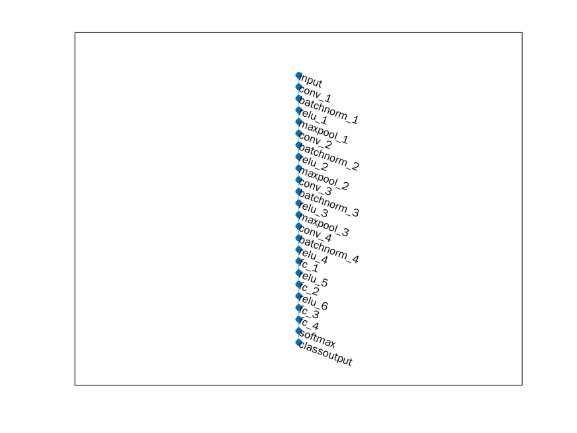
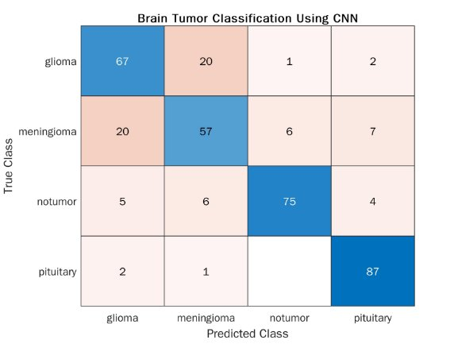

**clc** clears all the text from the Command Window, resulting in a clear screen.

clear removes all variables from the current workspace, releasing them from system memory. close all  closes all figures.

clc; clear all; close all;

fullfile( filepart1,...,filepartN ) builds a full file specification from the specified folder and file names.

imageFolder = fullfile("../br/br/Testing/");

imageDatastore** creates a datastore from the collection of image data specified by location .

imds = imageDatastore(imageFolder, €LabelSource€, €foldernames€, €IncludeSubfolders€,true); countEachLabel counts the number of times each unique label occurs in the datastore.

tb1 = countEachLabel(imds)

tb1 = 42 table

||Label|Count|
| :- | - | - |
|1|glioma|300|
|2|meningioma|306|
|3|notumor|405|
|4|pituitary|300|
minSetCount = min(tb1{:,2});

maxNumImages = 300;

minSetCount = min(maxNumImages,minSetCount);

splitEachLabel randomly assigns the specified proportion of files from each label to the new datastores.

imds = splitEachLabel(imds,minSetCount,€randomized€);

tb2 = countEachLabel(imds)

tb2 = 42 table

||Label|Count|
| :- | - | - |
|1|glioma|300|
|2|meningioma|300|
|3|notumor|300|

||Label|Count|
| :- | - | - |
|4|pituitary|300|

Spliting the imds datastore into **imdstrain** datastore with 70% of imds datastore and **imdtest** datastore with 30% of imds datastore.

[imdstrain,imdstest] = splitEachLabel(imds,0.7,€randomized€); imageSize=[256 256 1];

An **augmented image datastore** transforms  training dataset with optional preprocessing such as resizing, grayconversion.

datastore = augmentedImageDatastore(imageSize,imdstrain,"ColorPreprocessing","rgb2gray"

**Convolutional Neural Network:**

An **image input layer** inputs 2-D images to a network.

A **2-D convolutional layer** applies sliding convolutional filters to 2-D input. 

A **batch normalization layer** normalizes a mini-batch of data across all observations for each channel independently.

A **ReLU layer** performs a threshold operation to each element of the input, where any value less than zero is set to zero.

A **2-D max pooling layer** performs downsampling by dividing the input into rectangular pooling regions, then computing the maximum of each region.

A **fully connected layer** multiplies the input by a weight matrix and then adds a bias vector. A **softmax layer** applies a softmax function to the input.

A **classification layer** computes the cross-entropy loss for classification and weighted classification tasks with mutually exclusive classes.

layers = [ ...

`    `imageInputLayer(imageSize,€Name€,€input€)      convolution2dLayer(3,8,€Padding€,€same€)     batchNormalizationLayer

`    `reluLayer   

`    `maxPooling2dLayer(2,€Stride€,2)     convolution2dLayer(3,16,€Padding€,€same€)     batchNormalizationLayer

`    `reluLayer   

`    `maxPooling2dLayer(2,€Stride€,2)     convolution2dLayer(3,32,€Padding€,€same€)     batchNormalizationLayer

`    `reluLayer   

`    `maxPooling2dLayer(2,€Stride€,2)     convolution2dLayer(3,64,€Padding€,€same€)     batchNormalizationLayer

`    `reluLayer   

`    `fullyConnectedLayer(32)

`    `reluLayer   

`    `fullyConnectedLayer(16)

`    `reluLayer   

`    `fullyConnectedLayer(8)     fullyConnectedLayer(4)

`    `softmaxLayer

`    `classificationLayer ];

A **layer graph** specifies the architecture of a deep learning network

` `lgraph = layerGraph(layers);  figure

` `plot(lgraph)

trainingOptions returns training options with additional options specified by one or more name-value arguments.

` `options = trainingOptions(€sgdm€, ...

€MaxEpochs€,100,... €InitialLearnRate€,1e-4, ... €Verbose€,true, ... €Plots€,€training-progress€);

A **trainNetwork** trains CNN with train datastore and training options.

net = trainNetwork(datastore,layers,options);

Training on single CPU.

Initializing input data normalization. |========================================================================================| |  Epoch  |  Iteration  |  Time Elapsed  |  Mini-batch  |  Mini-batch  |  Base Learning  | |         |             |   (hh:mm:ss)   |   Accuracy   |     Loss     |      Rate       | |========================================================================================| |       1 |           1 |       00:00:15 |       28.12% |       1.5097 |      1.0000e-04 | |       9 |          50 |       00:02:10 |       85.16% |       0.5273 |      1.0000e-04 | |      17 |         100 |       00:04:05 |       89.84% |       0.3735 |      1.0000e-04 | |      25 |         150 |       00:06:04 |       96.09% |       0.2077 |      1.0000e-04 | |      34 |         200 |       00:08:01 |       99.22% |       0.1276 |      1.0000e-04 | |      42 |         250 |       00:09:52 |       97.66% |       0.1500 |      1.0000e-04 | |      50 |         300 |       00:11:43 |       98.44% |       0.0965 |      1.0000e-04 | |      59 |         350 |       00:13:36 |      100.00% |       0.0650 |      1.0000e-04 | |      67 |         400 |       00:15:29 |       99.22% |       0.0830 |      1.0000e-04 | |      75 |         450 |       00:17:22 |       99.22% |       0.0546 |      1.0000e-04 | |      84 |         500 |       00:19:20 |      100.00% |       0.0401 |      1.0000e-04 | |      92 |         550 |       00:21:09 |      100.00% |       0.0548 |      1.0000e-04 | |     100 |         600 |       00:22:59 |      100.00% |       0.0356 |      1.0000e-04 | |========================================================================================| Training finished: Max epochs completed.

**Save** the net model as net.mat for future use.

save(€net€,"net")

An **augmented image datastore** transforms  test dataset with optional preprocessing such as resizing, grayconversion.

imdsTest\_rsz = augmentedImageDatastore(imageSize,imdstest,€ColorPreprocessing€,€rgb2gray€

imdsTest\_rsz = 

`  `augmentedImageDatastore with properties:

`             `NumObservations: 360

`                       `Files: {3601 cell}     AlternateFileSystemRoots: {}

`               `MiniBatchSize: 128

`            `DataAugmentation: €none€

`          `ColorPreprocessing: €rgb2gray€

`                  `OutputSize: [256 256]

`              `OutputSizeMode: €resize€         DispatchInBackground: 0

**load** the model which was stored as net.mat

load net

**Classify** test dataawt using trained deep learning neural network

YPred = classify(net,imdsTest\_rsz);

confusionchart( trueLabels , predictedLabels ) creates a confusion matrix chart from true labels trueLabels and predicted labels predictedLabels and returns a ConfusionMatrixChart object.

cm = confusionchart(imdstest.Labels,YPred); cm.Title = €Brain Tumor Classification Using CNN€;

**Accuracy:**

accuracy = sum(imdstest.Labels == YPred,€all€)/numel(YPred)

accuracy = 0.7944

5
